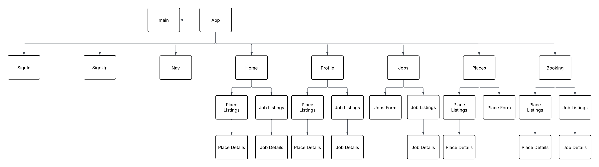
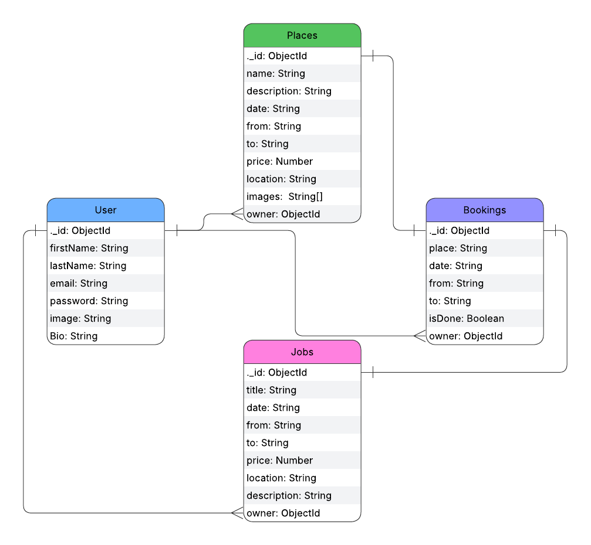

# QuickSpot

## Date: 23/10/2025

### By: Balqees Alawi, Hawraa Mohamed,

#### GitHub: [balqeesalawi](https://github.com/balqeesalawi) | [HawraAlaam](https://github.com/HawraAlaam) |

---

### **_Description_**

QuickSpot is the fast-track platform for Bahrainis who need immediate, short-term jobs or rental spaces. Whether you're looking to earn money for the day or find urgent staff, QuickSpot delivers quick results when you need them most.
  - For Job Seekers: Get hired for one-day or short-term jobs right away.
  - For Employers: Fill urgent staffing needs with reliable, on-demand workers.
  - For Renters & Property Owners: Find or lease properties for short durations without the hassle.

---
### Wireframe

#### [wireframe]()

---

### **_Technologies Used_**

- Git
  - GitHub
- VS code
  - HTML, CSS and JavaScript
- Framework
  - express
- Database
  - MongoDB
- Middlewares
  - mongoose
  - methodOverride
  - morgan
  - bcrypt

  ### **_apps used_**

  - VS code
  - trello
  - googleFonts

---

### **_Getting Started_**

#### You have first to sign in and if yoy don't have an account sign up, once you sign in you will be able to use every functionality on the website.

---

### **_Screenshots_**

#### Component Hierarchy Diagram Diagram

#### ERD

---
### **_Future Updates_**

- [ ]

---

### **_Credits_**

[github](https://github.com/SEB-X-Bahrain/class_wiki)
[w3schools](https://www.w3schools.com/)

#####

---
